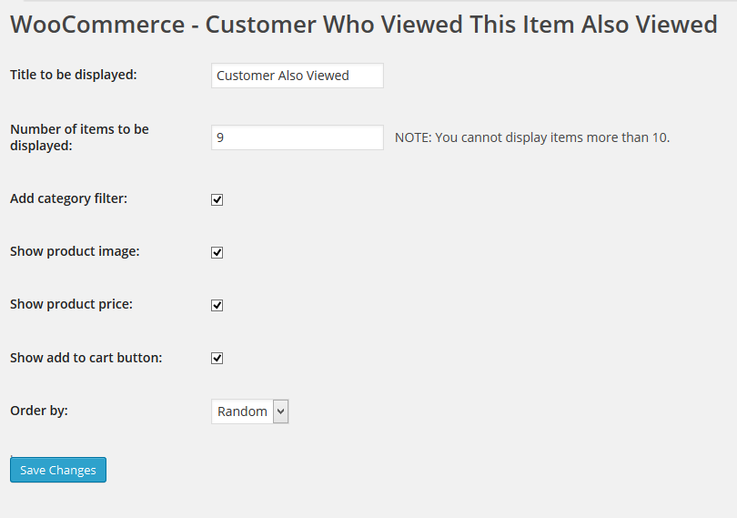
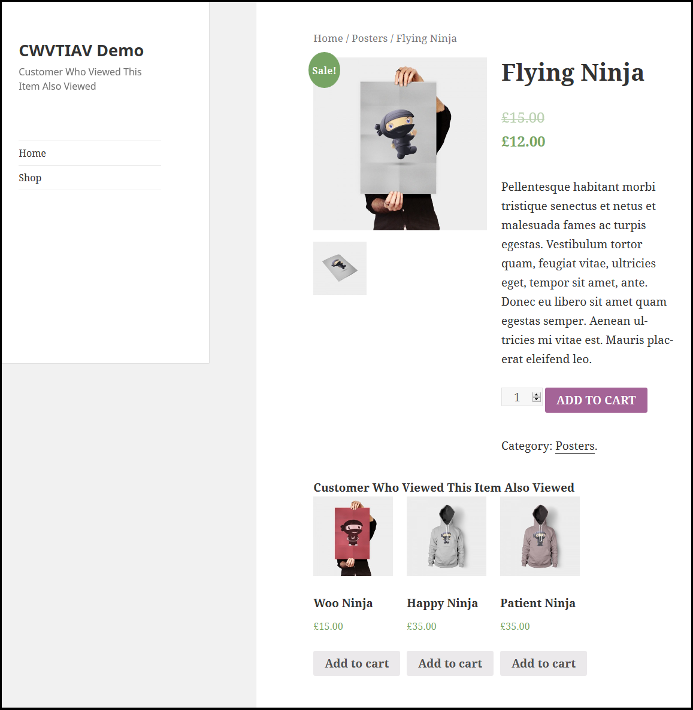

# woocommerce-embed-videos-to-product-image-gallery
“Customer Who Viewed This Item Also Viewed Using Woocommerce” is an intelligent and handy WooCommerce plugin that keeps track of customers’ shopping trends. Based on those statistics, it improves cross-selling mechanisms. This plugin will suggest products that customers mostly visited your site. These suggestions display on product pages based on the current product.

Supports repeated entries with optional fields like caption, description, image, etc.

# Installation
1. Download the plugin zip file from WordPress.org plugin site to your desktop / PC
2. If the file is downloaded as a zip archive, extract the plugin folder to your desktop.
3. With your FTP program, upload the plugin folder to the wp-content/plugins folder in your WordPress directory online
4. Go to the Plugin screen and find the newly uploaded Plugin in the list.
5. Click ‘Activate Plugin’ to activate it.

# How To Use

shows all the possible options available for this plugin.

shows front end view for this plugin.

# Getting Help
If you have any difficulties while using this Plugin, please feel free to contact us at opensource@zealousweb.com. We also offer custom WordPress extension development and WordPress theme design services to fulfill your e-commerce objectives. Our professional dy‐ namic WordPress experts provide profound and customer-oriented development of your project within short timeframes. Thank you for choosing a Plugin developed by ZealousWeb!
