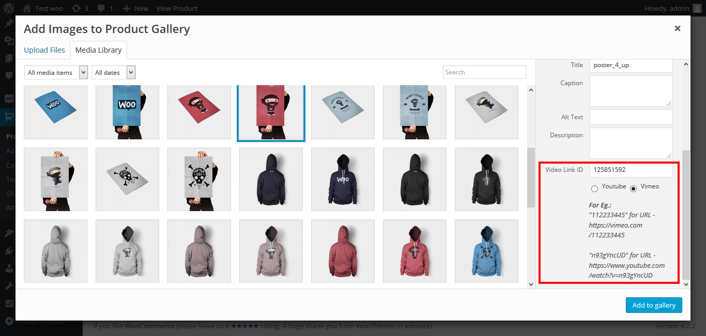
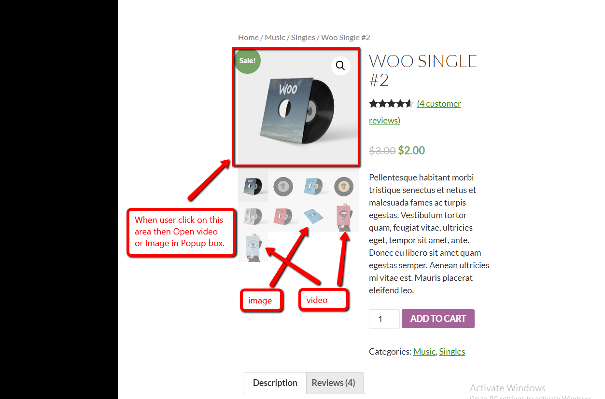
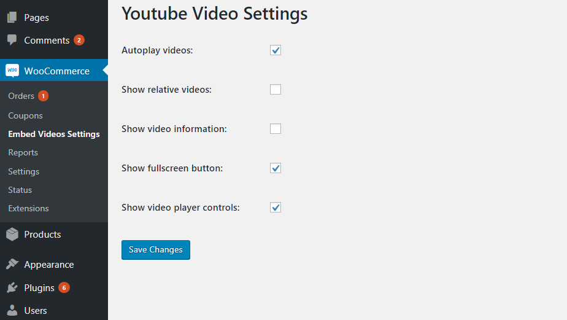

# woocommerce-embed-videos-to-product-image-gallery
WooCommerce is the most popular eCommerce plugin in WordPress CMS. WooCommerce enables Admins to convert WordPress sites into E-commerce sites. The ‘Embed videos for product image gallery using WooCommerce documentation’ plugin requires WooCommerce to be activated.

Embed videos to the product image gallery
Supports YouTube and Vimeo videos
Allows images and videos together in a single product gallery

**Embed Videos For Product Image Gallery Using WooCommerce Features**

- Embed videos to product image gallery
- Supports YouTube and Vimeo videos
- Video loads as inline embedded videos in place of featured image or in a lightbox based on WooCommerce settings
- Allows images and videos together in single product gallery
- Does not require to overwrite any WooCommerce core files
- Youtube video control parameters are supported.
- Compatibility with multisite network.
- Compatibility of WordPress VIP.

# Installation
1. Download the plugin zip file from WordPress.org plugin site to your desktop / PC
2. If the file is downloaded as a zip archive, extract the plugin folder to your desktop.
3. With your FTP program, upload the plugin folder to the wp-content/plugins folder in your WordPress directory online
4. Go to the Plugin screen and find the newly uploaded Plugin in the list.
5. Click ‘Activate Plugin’ to activate it.

# How To Use

shows front end view of inline embedded videos.

shows front end view of inline embedded videos.

shows settings page of Youtube video parameters.

# Getting Help
If you have any difficulties while using this Plugin, please feel free to contact us at opensource@zealousweb.com. We also offer custom WordPress extension development and WordPress theme design services to fulfill your e-commerce objectives. Our professional dy‐ namic WordPress experts provide profound and customer-oriented development of your project within short timeframes. Thank you for choosing a Plugin developed by ZealousWeb!
